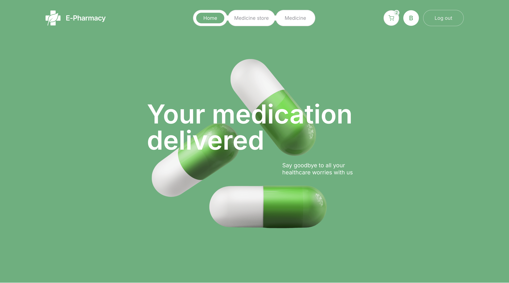
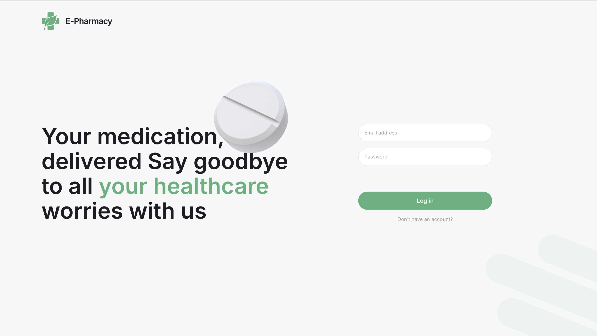
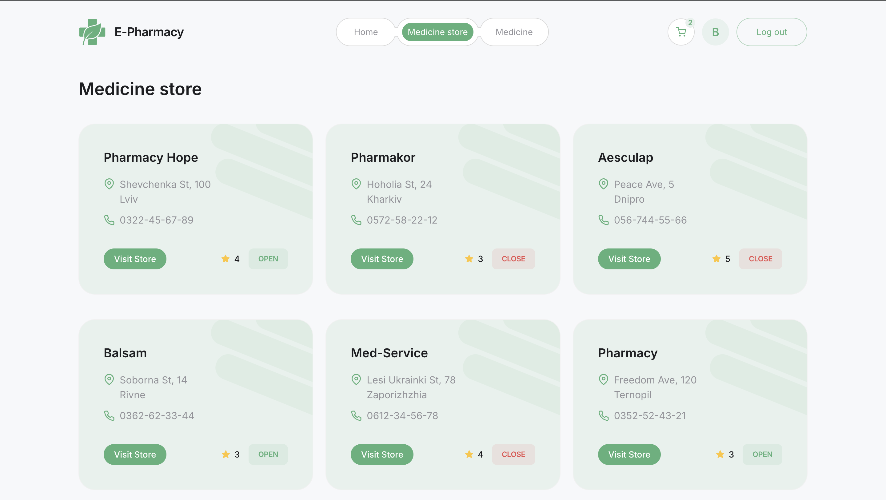
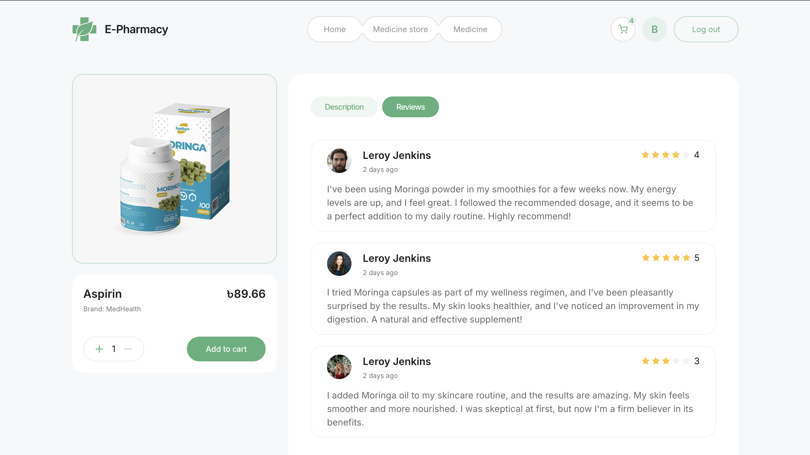

# E-Pharmacy

[**Live Page**](https://top-e-pharmacy.vercel.app/) - Check out the working version of the project.

## Overview

**E-Pharmacy** is a web platform for online pharmacies that allows users to order medications online with delivery. The platform offers a convenient interface for registration, login, browsing products, and making purchases.

## Main sections

**Home Page**:  
The main screen where users can explore offers and browse products.




**User Registration and Authentication**:  
Functionality for creating an account and logging into the system.


**Login Page**:  
Users can log in to access private features.



**Medicine Stores Page**:  
Browse stores with medications offering various discounts.



**Product Page**:  
View all products with the ability to search medications by name and filter by category, as well as add to the cart.


**Product Description and Reviews Page**:  
Detailed information about the product and customer reviews, with the option to change quantity and add to the cart.



**Cart Page**:  
View items added to the cart and proceed with the order.


## Features

- **Responsive Design**: Optimized for mobile, tablet, and desktop devices (from 320px to 1440px).
- **Product Search and Filtering**: Users can search for medications by name and filter by category.
- **Registration and Authentication**: Users can register and log in to access their account and orders.
- **Order Processing**: Users can easily add items to the cart and place an order.
- **Discounts and Promotions**: Users can view current discounts and promotions.
- **Security**: The platform ensures secure processing of users' personal data.

## Technologies

**Frontend:**

- React for building the interface
- Redux Toolkit for state management
- React Router for navigation
- Vite for fast development and bundling
- Material UI for interface components

**Backend:**

- JWT Authentication for user authentication
- MongoDB for storing user, product, and order data

## Get Started

To run the project locally, follow these steps:

1. **Clone the repository:**

   ```bash
   git clone https://github.com/MykhailoVobolis/e-pharmacy.git
   ```

2. **Navigate to the project folder:**

   ```bash
   cd e-pharmacy
   ```

3. **Install dependencies:**

   ```bash
   npm install
   ```

4. **Run the development server:**

   ```bash
   npm run dev
   ```

5. **Open [http://localhost:5173](http://localhost:5173) in your browser to view the app.**

## Materials

[Live Page](https://top-e-pharmacy.vercel.app/) — check out the working version of the project.

[Technical Requirements](https://docs.google.com/spreadsheets/d/1TdZTkbTSEcscopFAAH1XiiAbkP8IOawIugpvaG9xnuw/edit?gid=0#gid=0) — project details that were used for development.

[Figma Design](<https://www.figma.com/file/qrKzOBVqM6zOZNFkTOpEO0/E-PHARMACY-(clients)?type=design&node-id=0-1&mode=design&t=O9kTuPJAS2bjEuwM-0>) — interface design that was used to create the project..
