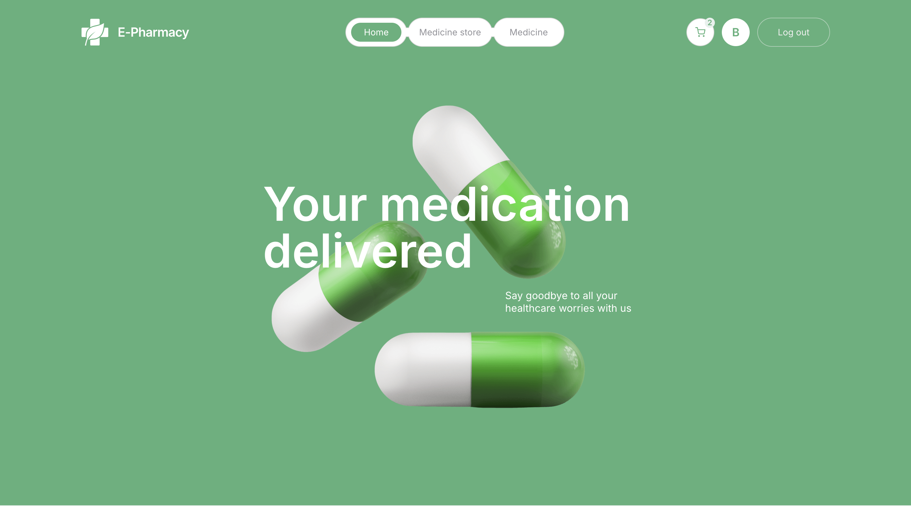
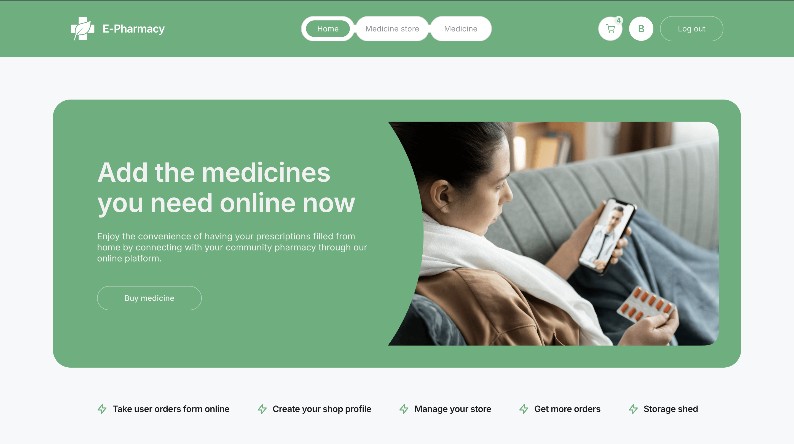
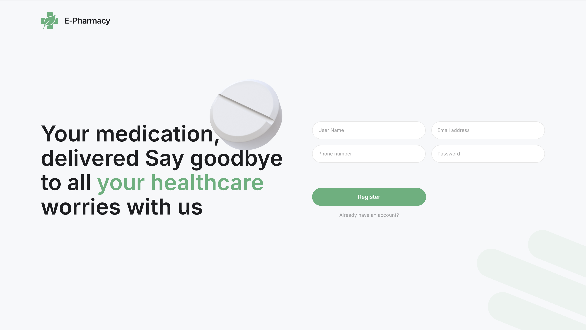
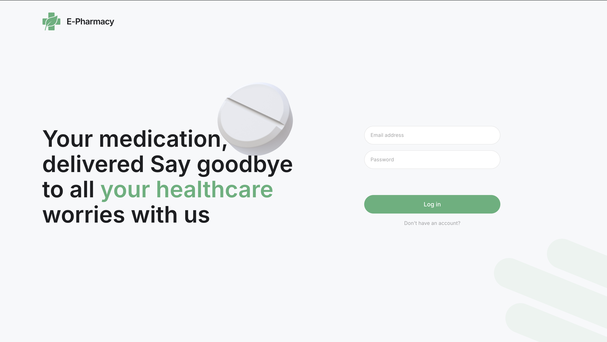
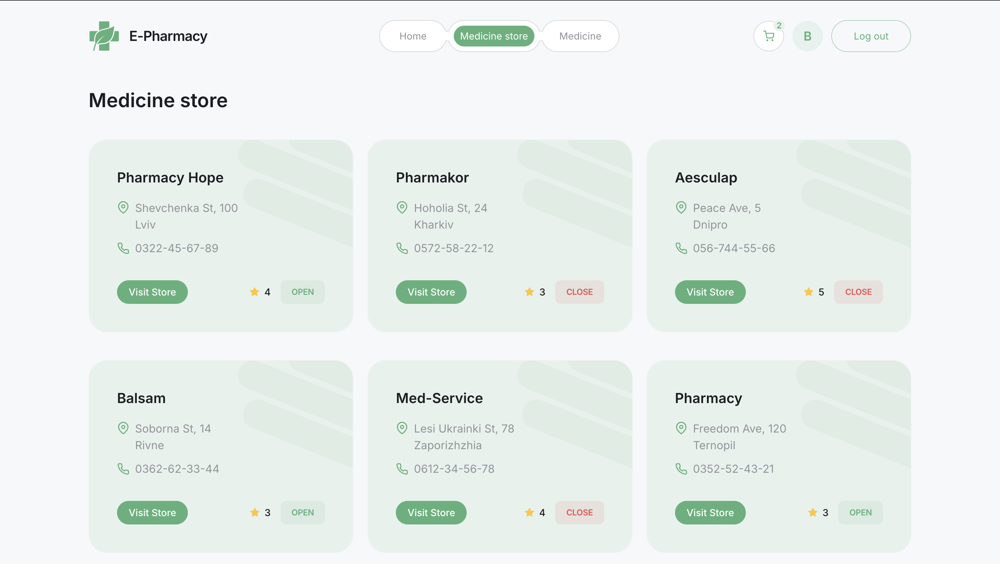
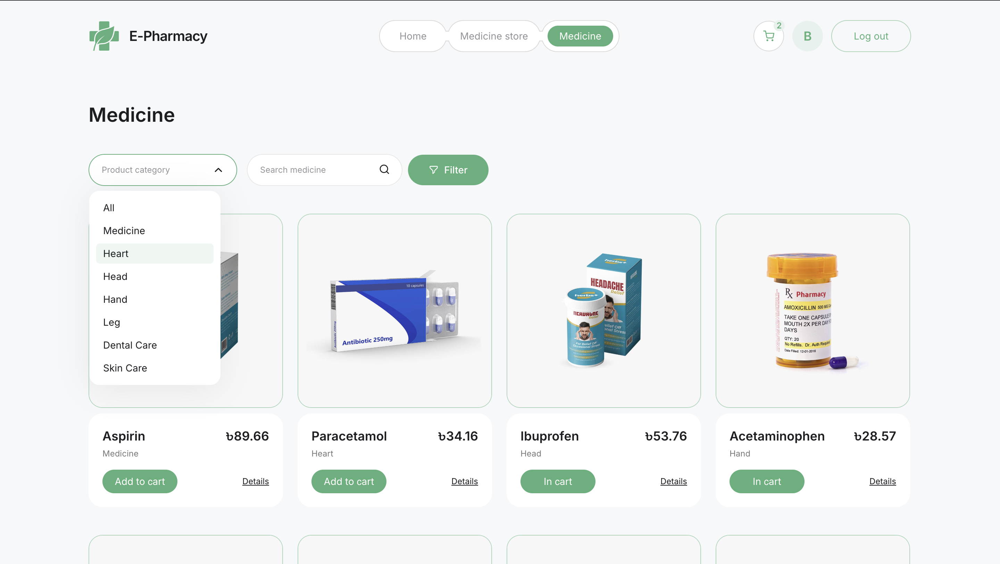
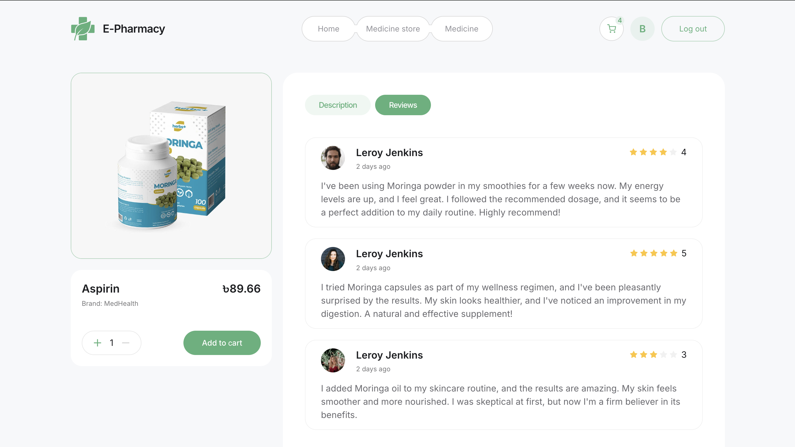
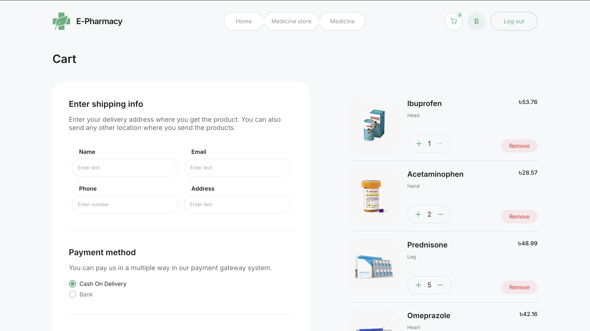

# E-Pharmacy

[**Жива сторінка**](https://top-e-pharmacy.vercel.app/) - перегляньте робочу версію проєкту.

## Огляд

**E-Pharmacy** — це веб-платформа для онлайн-аптек, яка дозволяє користувачам замовляти медикаменти онлайн з доставкою. Платформа пропонує зручний інтерфейс для реєстрації, входу, перегляду товарів і здійснення покупок.

## Основні розділи

**Домашня сторінка**:  
 Основний екран, де користувачі можуть ознайомитися з пропозиціями та перейти до товарів.





**Реєстрація та авторизація користувачів**:  
 Функціонал для створення акаунту та входу в систему.



**Сторінка входу**:  
 Користувачі можуть увійти в систему для доступу до приватних функцій.



**Сторінка магазинів ліків**:  
 Перегляд магазинів з медикаментами з різними знижками.



**Сторінка товарів**:  
 Перегляд всіх товарів з можливістю шукати медикаменти за назвою та фільтрувати за категорією, а також додавати до кошика.



**Сторінка опису продукту та відгуків**:  
 Детальної інформації про товар та відгуки покупців, з можливістю зміни кількості та додавання до кошика.



**Сторінка кошику товарів**:  
 Перегляд доданих до кошика товарів та оформлення замовлення.



## Особливості

- **Адаптивний дизайн**: Оптимізовано для мобільних, планшетів та настільних пристроїв (від 320px до 1440px).
- **Пошук та фільтрація товарів**: Користувачі можуть шукати медикаменти за назвою та фільтрувати за категорією.
- **Реєстрація та авторизація**: Користувачі можуть зареєструватися та увійти в систему для доступу до свого акаунту та замовлень.
- **Оформлення замовлень**: Користувачі можуть зручно додавати товари до кошику та оформлювати замовлення.
- **Знижки та акції**: Користувачі можуть ознайомитися з актуальними знижками та акціями.
- **Безпека**: Платформа забезпечує безпечну обробку особистих даних користувачів.

## Технології

**Frontend:**

- React для побудови інтерфейсу
- Redux Toolkit для управління станом
- React Router для навігації
- Vite для швидкої розробки та зборки
- Material UI для компонентів інтерфейсу

**Backend:**

- JWT Authentication для автентифікації користувачів
- MongoDB для зберігання даних про користувачів, товари та замовлення

## Розпочніть роботу

Щоб запустити проєкт локально, виконайте наступні кроки:

1. **Склонуйте репозиторій:**

   ```bash
   git clone https://github.com/MykhailoVobolis/e-pharmacy.git
   ```

2. **Перейдіть до папки проєкту:**

   ```bash
   cd e-pharmacy
   ```

3. **Встановіть залежності:**

   ```bash
   npm install
   ```

4. **Запустіть сервер розробки:**

   ```bash
   npm run dev
   ```

5. **Відкрийте [http://localhost:5173](http://localhost:5173), щоб переглянути в браузері.**

## Матеріали

[Жива сторінка](https://top-e-pharmacy.vercel.app/) — ознайомтеся з працюючою версією проєкту.

[Технічне завдання](https://docs.google.com/spreadsheets/d/1TdZTkbTSEcscopFAAH1XiiAbkP8IOawIugpvaG9xnuw/edit?gid=0#gid=0) — деталі проєкту, які було використано для розробки.

[Макет Figma](<https://www.figma.com/file/qrKzOBVqM6zOZNFkTOpEO0/E-PHARMACY-(clients)?type=design&node-id=0-1&mode=design&t=O9kTuPJAS2bjEuwM-0>) — дизайн інтерфейсу, який використовувався для створення проекту.
